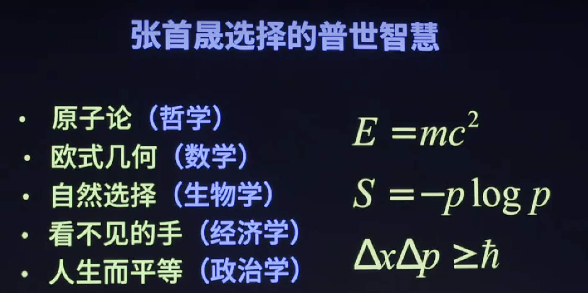

# FirstPrinciple👀
📅2022年9月26日·👦theRunCom·🏷️[knowledge](https://github.com/theRunCom/FirstPrinciple)

*有关第一性原理的相关资料！！！*

## 目录
- [刻意练习](#刻意练习)
- [思维模型学习法](#思维模型学习法)
- [读书学习](#读书学习)
- [第一性原理是使用演绎法的推理基石](#第一性原理是使用演绎法的推理基石)
- [第一性原理背后的哲学基石](#第一性原理背后的哲学基石)
- [如何发现第一性原理](#如何发现第一性原理)
---

## 刻意练习

```
人类只有发明了发明的方法之后才能快速发展，我们只有学习了学习的方法之后才能成为高手。    —— 芒格
```

过去30年，心理学家系统地研究了各行各业的从新手到专家，甚至到世界级大师的**训练方法**，包括运动员、音乐家、国际象棋棋手、医生、数学家、记忆力者等。

而这种训练方法，叫做刻意练习，为了提高能力而被刻意设计出来的练习。

研究表明，一旦动作达到“自动化”的程度，即使再多练习几年，也不会有什么进步。所以千万别做舒适区里炫技的小猴子。

### 刻意练习方法论
1. 创建模型

    在《刻意练习》这本书中说道刻意练习的主要目的是创建有效的心理表征。心理表征，是一种与我们大脑正在思考的某个物体、某个观点、某些信息或者其他任何事物相对应的心理结构。其实归根到底，就是“套路”。

    何为“套路”？
    - 围棋的定式
    - 编程的算法
    - 律师的案例
    - 数学家公式
    - 科学家定律

    对脑力工作者来说，水平高低在于掌握的套路的多少。
2. 刻意练习

    美国高水平檄榄球运动员只有1%时间用于队内比赛，其他时间都是针对特殊技术动作的基础训练。
    
    研究表明，棋手用来记定式和打棋谱所花的时间，而不是与对手对奔所花的时间，是棋手水平高低唯一重要的指示符。

3. 及时反馈

    为什么世界排名第一的网球运动员、高尔夫运动员、象棋运动员还需要教练？
    - 教练的第一作用是，在训练中以旁观者身份提供即时反馈。

    在刻意练习中，在有即时反馈的情况下，一个人的进步速度非常之快。


### 刻意练习目的
练习的目的是将套路“内化”到大脑中，错误的练习危害极大。

人脑是怎么掌握一个技能的？
- 神经元如果经常被一起激发，它们最终就会被连在一起。于是，不同技能在人的大脑中形成了不同的网络结构。

技能是“长”在大脑之中的！

高手与普通人的本质区别：高手拥有长期正确训练所获得的特殊脑神经结构。

### 刻意练习其他注意事项
- 永远不要停留在舒适区；
- 学以致用才是有效学习；
- 请教练或导师很有帮助。

**[⬆ 回到目录](#目录)**

## 思维模型学习法

```
有两种学习方式：第一种是自我实践和向他人学习，第二种是看书、学习理论。绝大部分人属于第一种。——《朋友圈的尖子生》
```

1. 任何事物背后必有道理
    ```
    我有一个很关键的行为习惯：当自己的直觉和证据相冲突的时候，我每次都相信证据，即使那个直觉是我特别想要的。——《朋友圈的尖子生》
    ```

    - 价值网理论，由外界给定的KPI约束的价值网
        👇
        择业禁忌：与周围同学同质化竞争，服从一个KPI价值网

    - 芒格的“多元思维模型”：
        ```
        我坚信存在某个系统-几乎所有聪明人都能掌握的系统。有了那个系统之后，你就能逐渐提高对事物的认识。—— 芒格
        ```
        芒格刻意练习的基本单元是 **思维模型**（A framework to think）

        芒格：在商界有条非常有用的古老守则，它分两步：

            1）找到一个简单的、基本的道理；

            2）非常严格地按照这个道理行事。

        ```
        “我一生都在追寻更好的思维模型。” —— 芒格
        ```

        “多元” —— 广度！

        硬科学：
        + 数学的复利模型

        + 物理学的临界点模型

        + 生物学的现代综合进化论

        + 化学的自我催化模型

        + 工程学的冗余备份模型

        ```
        “你必须把它们种到你的头脑里，然后用毕生的时间去培养它们。让它们变成你随时能够使用的本领。” —— 芒格
        ```

        
2. 这个理论还可以解释其它什么现象？


3. 我的哪些行为可以用这个理论改进？
